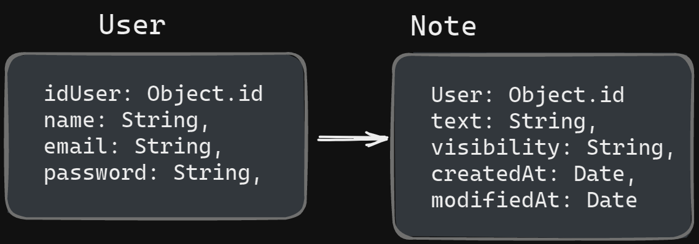
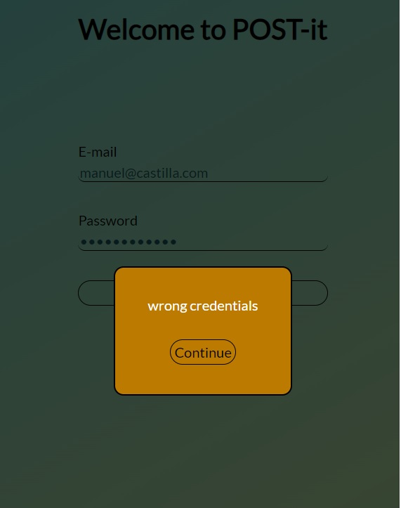
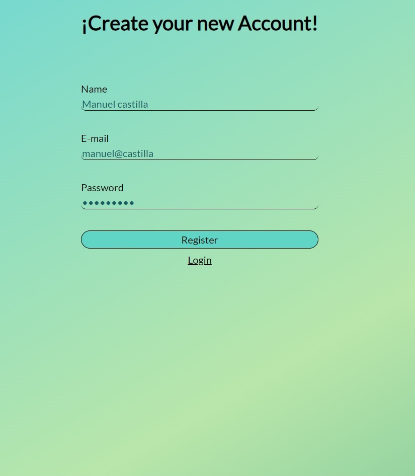
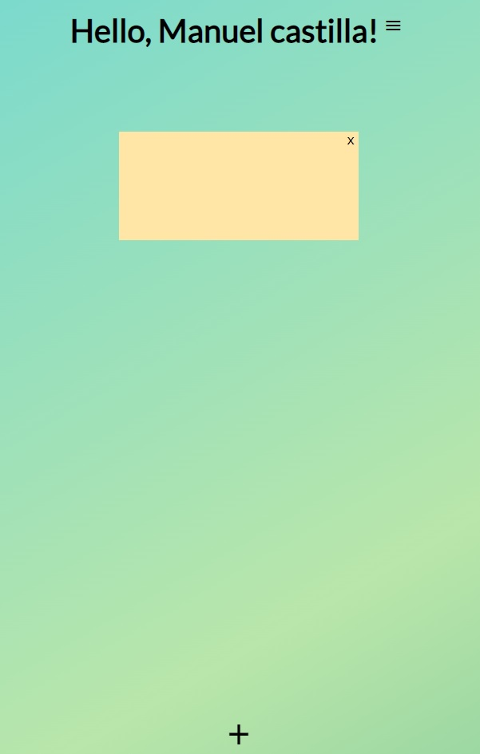
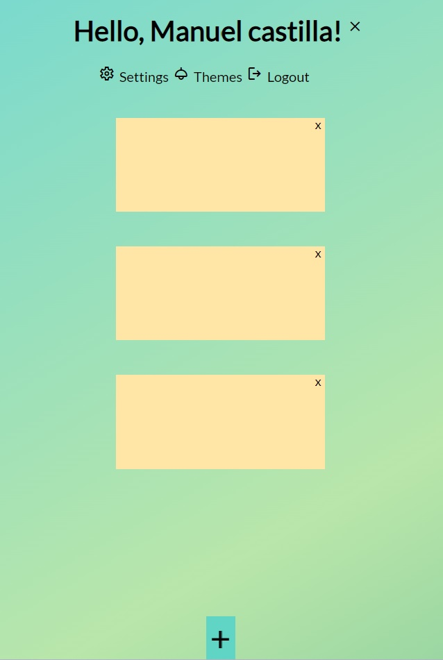
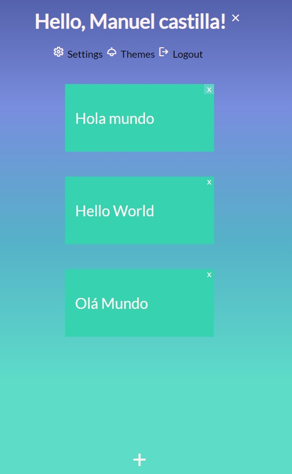
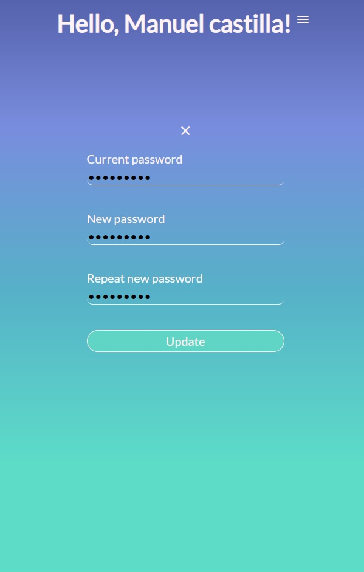

# Description of POST-it
    
    This Web application is developed for those people who need a place to write down their daily tasks or reminders, here you can create your personal notes that will be linked to your account!
 
 

# Funcional Description

    In this application you can log in through a JWT system that opens from anywhere with your mobile allowing you to use it spontaneously. Inside you can also create your notes, modify and delete them. You can also change your password and play with the color changes of the theme.
 
 

# Tecnhical Description
 

- Login

- Register
    - create user

- Home
    - User
        - create note
        - update note
        - delete note

- Home
    - Change Password
    - Change Theme
    - Logout

# Use cases

 
User

 - create note
 - update note
 - delete note
 - change themes
 - change password
 
 

# Flows

#  UI Desing

# Technical Description

 - Blocks
 - Sequence
 - Components
 - QA units
 - Technologies

# Data Model

User
- id: ObjectId
- name: String
- email: String
- password: String

Note
- id: ObjectId
- text: String

# Technologies 

 - Mongoose
 - express
 - jsonwebtoken
 - winston
 - Test Jest
 - JS React
 - winstone
 - TODO sass

# Images

